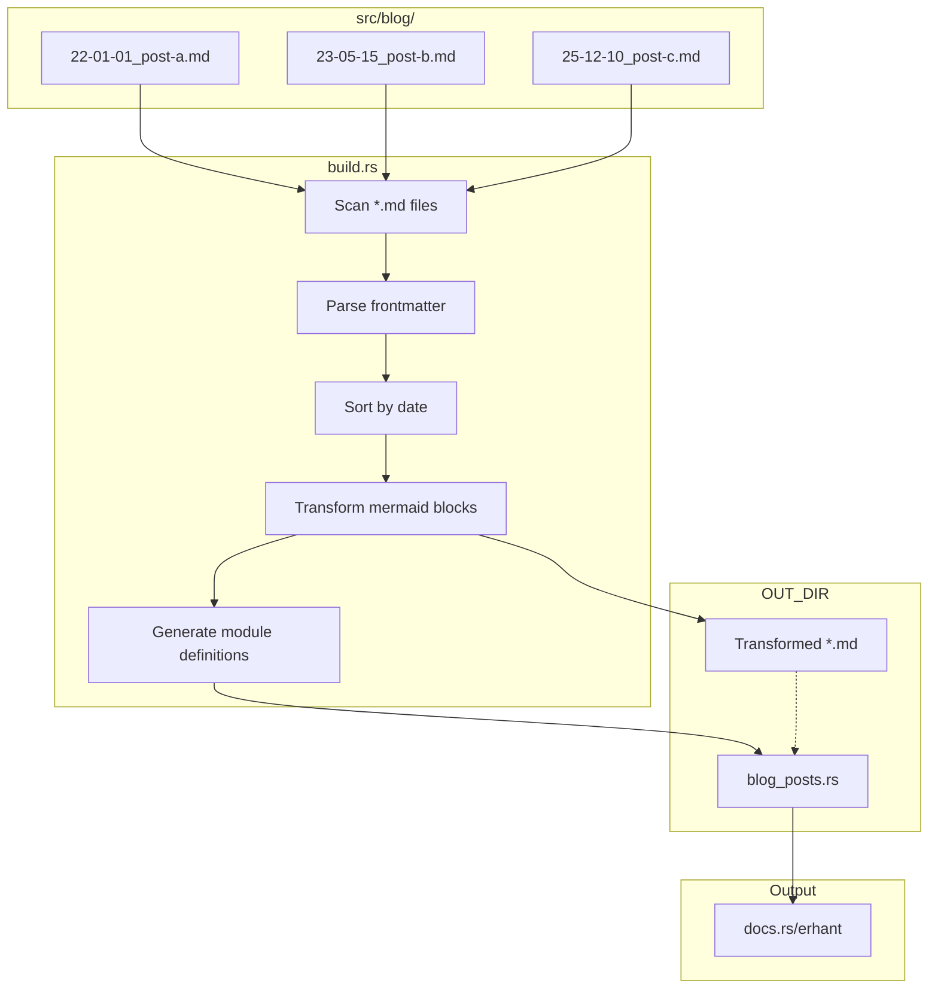

<!--
date: "2026-01-25"
tags: [rust]
-->

# Blogging on docs.rs

One day I woke up and decided that my blog should live where my heart is: Rust docs. So here we are, unashamedly piggy-backing on [docs.rs](https://docs.rs).

## Why docs.rs?

- **Free hosting**: & its pretty cool tbh
- **Markdown-based**: Write in markdown, rendered beautifully
- **Version control**: Every version is preserved forever
- **Syntax highlighting**: All codeblocks are highlighted
- **Math rendering**: KaTeX support via custom header
- **Diagrams**: Mermaid.js for flowcharts and diagrams

## How It Works

The magic happens through Rust's documentation system. Each blog post is a markdown file that becomes a module's doc comment. Here's the flow:



### The Build Script

When you run `cargo build`, `build.rs` does all the heavy lifting:

1. **Scans** `src/blog/` for markdown files
2. **Parses** HTML-commented frontmatter for metadata (date, tags)
3. **Sorts** posts by date, newest first
4. **Transforms** mermaid code blocks into HTML with Mermaid.js
5. **Generates** `blog_posts.rs` with full module definitions

The build script generates Rust code like this directly:

```rust
#[doc = "**Published:** 2025-01-01 | **Tags:** rust, meta"]
#[doc = ""]
#[doc = "---"]
#[doc = ""]
#[doc = include_str!("/path/to/transformed/post.md")]
pub mod n1_hello_docsrs {}
```

The numbering (`n1_`, `n2_`, ...) ensures docs.rs displays posts in reverse chronological order. A custom header enables KaTeX for math like $e^{i\pi} + 1 = 0$ and enables syntax highlighting for a variety of languages, including Solidity.

### Adding a New Post

1. Create `src/blog/YY-MM-DD_slug.md`
2. Add frontmatter:
   ```markdown
   <!--
   date: "YYYY-MM-DD"
   tags: [tag1, tag2]
   -->
   ```
3. Write your content (mermaid diagrams just work)
4. Run `make build` to check everything works
5. Run `make docs` to actually view docs locally
6. Run `make publish` to publish new version

If you think this is cool or retarted, [leave a star](https://github.com/erhant/erhant)!
