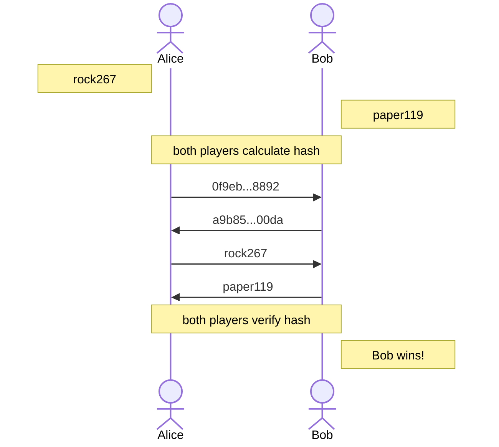

<!--
date: "2022-10-17"
tags: [cryptography, math]
title: "Rock-Paper-Scissors Over the Phone"
summary: "Using hash functions to play RPS asynchronously via commit-reveal."
-->

# Rock-Paper-Scissors Over the Phone

In this post, we will learn how we would play Rock-Paper-Scissors (RPS) over the phone. What do we mean by that?

Well, the original game is played face-to-face, and "some body-language protocol" is used so that both players play their move at the same time. It is important that the moves are played in such a way, because otherwise you would simply play the countering move.

On the other hand, playing over the phone makes it REALLY hard to play the moves at the same time. In this post we will see how cryptography makes the game possible in such a way that moves need not be played at the same time.

## Hash Functions

You have most likely heard about hash functions if you have been reading about computer science for a while. They are absolutely useful for a vide variety of things! In a very summarized way, here is what you need to know about them:

- They take in arbitrarily long input, and produce a fixed-length output. The output is referred to as **digest**.
- The same input ALWAYS produces the same output.
- It is almost impossible to learn the input just by looking at the output.

There are many different implementations of hash functions, with varying efficiencies, computation domains and output lengths. Let us take SHA256 for our case. You can find many tools online that let you calculate hashes, such as [this one](https://xorbin.com/tools/sha256-hash-calculator).

Let us calculate the hash of "i like turtles". If you go and type it as input to the SHA-256 function, you will get:

```text
47f0c23ae1cc6ce8ccfe96b73a70fb45192750523a15e2c9dc14fa98d7e8264e
```

If you were given this output, you would have no idea that the input was "i like turtles"! That is until, someone has a table that maps inputs to digests and you search for this output in that table to find the corresponding input, but that is another story.

## Playing the Game

Hash values let us commit to some value, in a cryptographically provable way:

- I can produce an output for an input that only I know of.
- Others can learn about this output, without learning about the input.
- If asked, I can tell them the input and they can verify the output by hashing it.

Now, here is how we will play the game:

1. Both players choose their move, which is either `rock`, `paper` or `scissors`. Let's say they played `rock` and `paper` on their own.
2. Both players pick a random number, let's say `267` and `119`.
3. Both players will hash the following input: `move || number`. Here, `||` means to concatenate. So the first player will hash `rock267` and the other will hash `paper119`. The corresponding outputs will be as follows:
   - **rock267**: `0f9eb01fbb667692cb15001ec9649dea8f26b8b3bacc28d25fc06100e8578892`
   - **paper119**: `a9b85af4472c66c928465c6db5ebc8252dcf340876b5c941af298b068b6c00da`

4. Until this point, both players do not know what the moves are, because they do not know the random numbers used within the input. If you were to hash `rock` or `paper` only, you could have known the digest by some precomputation. So now, they can tell their moves and numbers.

5. Players verify the hashes they have received by hashing the said move and numbers again; et viola, they have just played rock-paper-scissors asynchronously.



_This post was inspired from the paper by Manuel Blum's paper [Coin flipping by telephone](https://dl.acm.org/doi/10.1145/1008908.1008911)._
