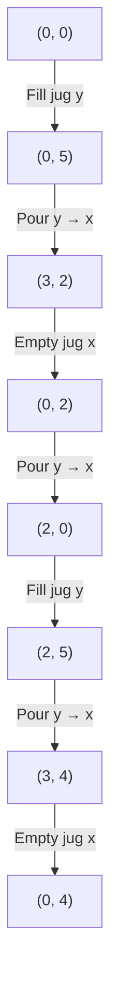

<!--
date: "2026-03-31"
tags: [typescript]
title: "Water & Jug Problem"
summary: "A cute puzzle involving water jugs & GCD."
-->

# Water & Jug Problem

I've recently came across the classical LeetCode problem [Water & Jug](https://leetcode.com/problems/water-and-jug-problem/), and the GCD solution is just so elegant that I wanted to write it here too.

## The Problem

You are given two water jugs with capacities $x$ and $y$ liters. There is an infinite amount of water supply available. You need to determine whether it is possible to measure exactly $z$ liters using these two jugs, with the rules being:

- You can fill any of the jugs completely with water.
- You can empty any of the jugs.
- You can pour water from one jug to the other until either the first jug is empty or the second jug is full.

So basically you have to fill out the function:

```typescript
/**
 * @param x capacity of jug 1
 * @param y capacity of jug 2
 * @param z target amount of water to measure
 * @returns true if it's possible to measure exactly z liters, false otherwise
 */
function canMeasureWater(x: number, y: number, z: number): boolean {
  // ...
}
```

## The Solution

Besides the trivial cases of $z = 0$ or $z > x + y$, the key to solving this problem is to realize that you can only measure amounts of water that are multiples of the greatest common divisor (GCD) of $x$ and $y$. To see why, we need [Bezout's identity](https://en.wikipedia.org/wiki/B%C3%A9zout%27s_identity), which states that for any integers $x$ and $y$, there exist integers $m$ and $n$ such that:

$$
mx + ny = \gcd(x, y)
$$

If the target $z$ is a multiple of $\gcd(x, y)$, then we can express $z$ as a linear combination of $x$ and $y$. But how does this relate to the water jug operations? Let's work through an example first.

### Example: $x = 3$, $y = 5$, $z = 4$



We reach 4 liters! Now let's redo the same steps, but this time we write each jug's water level as a combination of $3$'s and $5$'s:

| Step | Action                            | Jug $x$ (3L)       | Jug $y$ (5L)     |
| ---- | --------------------------------- | ------------------ | ---------------- |
| 1    | Fill jug $y$                      | $0$                | $+5$             |
| 2    | Pour $y \to x$ until $x$ is full  | $+(3 - 0)$         | $+5-(3 - 0)$     |
| 3    | Empty jug $x$                     | $0$                | $+5-3$           |
| 4    | Pour $y \to x$ until $y$ is empty | $+5-3$             | $0$              |
| 5    | Fill jug $y$                      | $+5-3$             | $+5$             |
| 6    | Pour $y \to x$ until $x$ is full  | $+5-3 +(3-(+5-3))$ | $+5 -(3-(+5-3))$ |
| 7    | Empty jug $x$                     | $0$                | $+5 -(3-(+5-3))$ |

At the end, the total water across both jugs is:

$$
(0) + (+5 -(3-(+5-3))) = (-2) \cdot 3 + 2 \cdot 5 = 4
$$

That's Bezout's identity! Since $\gcd(3, 5) = 1$, we expressed our target $4$ as a linear combination of $3$ and $5$.

### Why This Always Works

The insight is that every jug operation only ever adds or removes multiples of $x$ and $y$. We can think of each jug as maintaining its own running expression in terms of $x$ and $y$:

- **Filling** a jug adds the jug's capacity to its expression (e.g. filling jug $y$ adds $+y$).
- **Emptying** a jug resets its expression to zero (effectively subtracting whatever was in it).
- **Pouring until the source is empty** moves the source's entire expression into the destination.
- **Pouring until the destination is full** is similar: the amount transferred can also be written in terms of $x$ and $y$, since "remaining capacity" is just "total capacity minus current amount", and both of those are already expressed in terms of $x$ and $y$.

Since every operation preserves the property that each jug's water level is a linear combination of $x$ and $y$, the total water across both jugs is always some $mx + ny$. By Bezout's identity, the smallest positive value achievable this way is $\gcd(x, y)$, and every achievable value is a multiple of it. So $z$ is measurable if and only if $\gcd(x, y)$ divides $z$.
